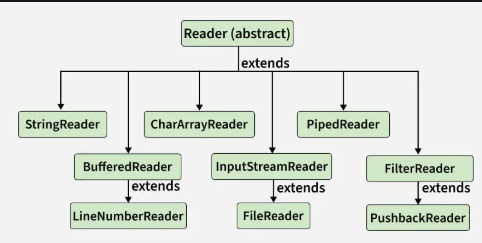

# Java Reader Class
Last Updated : 10 Dec, 2025
The Reader class in Java is an abstract class for reading character streams. Its subclasses (FileReader, BufferedReader) provide implementations, with read() being the main method to read characters.

It implements the Readable interface that defines the read(CharBuffer cb) method.
It implements the Closeable interface that defines the close() method to release resources.

Declaration of Reader Class
Declaration of Reader class is given below:

public abstract class Reader implements Readable, Closeable 

Example: Read a text file character by character using the Reader class.
import java.io.*;

# public class Geeks {
# 
#     public static void main(String[] args)
#     {
#         try {
#           
#             // Create a FileReader object which is a subclass of Reader
#             Reader r = new FileReader("example1.txt");
# 
#             // Read one character at a time from the file
#             int data = r.read();
#             while (data != -1) {
#               
#                 // Convert the int to char and print
#                 System.out.print((char)data);
#                 data = r.read();
#             }
# 
#             // Close the reader
#             r.close();
#         }
#         catch (Exception ex) {
#           System.out.println("An error occurred: " + ex.getMessage());
#         }
#     }
# }

# Note:
Abstract class for reading character streams. The only methods that a subclass must implement are read(char[], int, int) and close(). Most subclasses, however, will override some of the methods defined here in order to provide higher efficiency, additional functionality, or both.