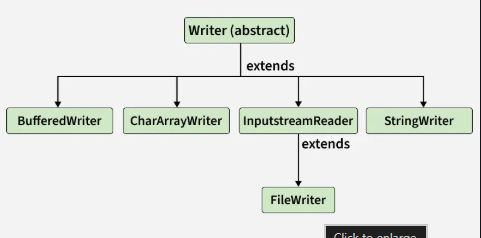

# Java Writer Class

The Java writer class is an abstract class in the java.io package. It is designed for writing character streams. It provides methods for writing characters, arrays of characters and strings to files, memory, or other output destinations.

# Declaration of the Writer Class
public abstract class Writer implements Appendable, Closeable, Flushable

Since it’s an abstract class, we can’t instantiate it directly; instead, we use concrete subclasses like

# Constructors of the Writer Class
The Writer class in Java has two protected constructors that allow for the creation of character streams with synchronization capabilities.

# Protected Writer(): 
    Creates a new character stream that can itself synchronize on the writer.
# protected Writer(Object obj): 
    Creates a new character stream that can itself synchronize on the given object – ‘obj’.