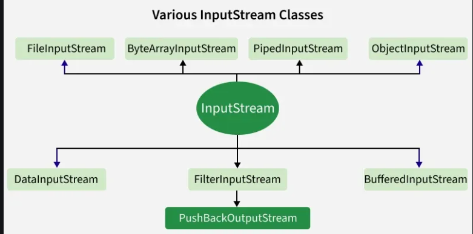
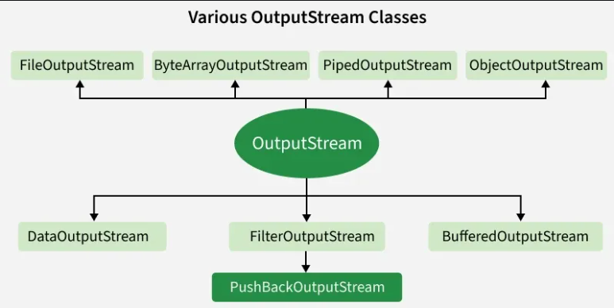
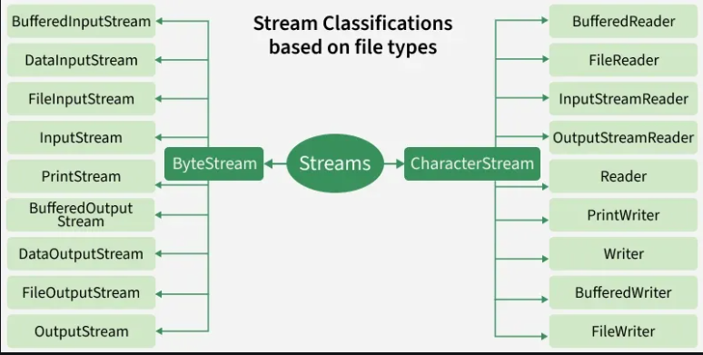
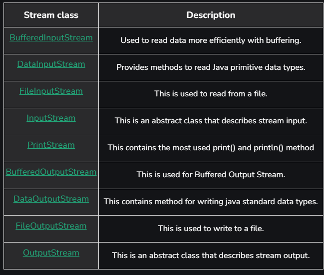
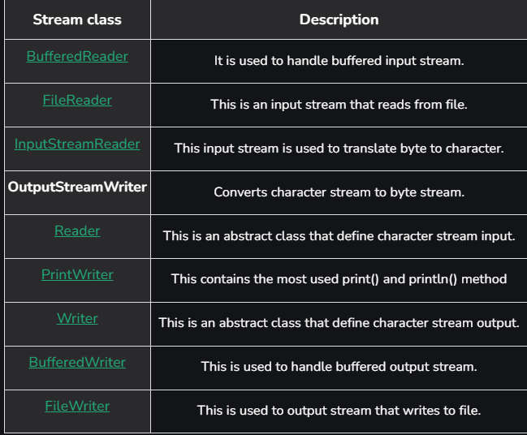
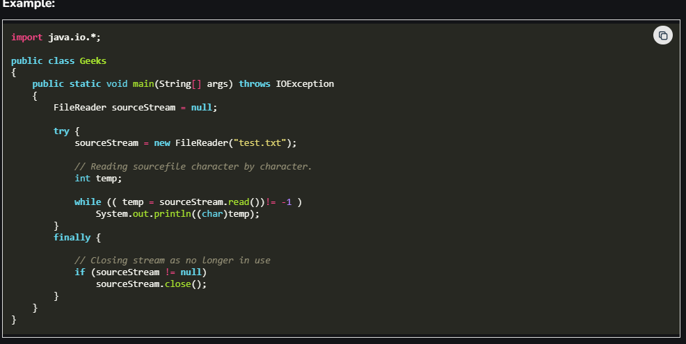

# Input/Output in Java with Examples
Last Updated : 10 Dec, 2025
Java I/O (Input/Output) is a collection of classes and streams in the java.io package that handle reading data from sources (like files, keyboard, or network) and writing data to destinations (like files, console or sockets). It provides both byte and character streams to support all types of data.

# Default/Standard Streams in Java
Before exploring various input and output streams, let's look at 3 most commonly used default streams that Java has provided:

# System.in: 
    This is the standard input stream that is used to read characters from the keyboard or any other standard input device.
# System.out:
     This is the standard output stream that is used to produce the result of a program on an output device like the computer screen.
# System.err:
     This is the standard error stream that is used to display error messages separately from normal output.

# Functions used with Default Streams:
# 1. System.in
System.in is an InputStream, so it provides methods from the InputStream class. Commonly used ones are:

int read(): reads one byte of data.
int read(byte[] b): reads bytes into an array.
int read(byte[] b, int off, int len): reads bytes into part of an array.
void close(): closes the input stream.
int available(): returns the number of bytes that can be read without blocking.
 Usually, System.in is wrapped with classes like Scanner or BufferedReader for easier input handling.

# Types of Streams
Depending on the type of operations, streams can be divided into two primary classes:

# 1. Input Stream: These streams are used to read data that must be taken as an input from a source array or file or any peripheral device. For eg., FileInputStream, BufferedInputStream, ByteArrayInputStream etc.

# 2. Output Stream: These streams are used to write data as outputs into an array or file or any output peripheral device. For eg., FileOutputStream, BufferedOutputStream, ByteArrayOutputStream etc.

# Types of Streams Depending on type of data (byte vs character)
Depending on the types of file, Streams can be divided into two primary classes which can be further divided into other classes as can be seen through the diagram below followed by the explanations.

# 1. ByteStream:

Byte streams in Java are used to perform input and output of 8-bit bytes. They are suitable for handling raw binary data such as images, audio, and video, using classes like InputStream and OutputStream.

# Here is the list of various ByteStream Classes:

# import java.io.*;
# public class Geeks {
#     public static void main(
#         String[] args) throws IOException
#     {

#        FileInputStream sourceStream = null;
#        FileOutputStream targetStream = null;

#        try {
#            sourceStream
#                = new FileInputStream("sourcefile.txt");
#            targetStream
#                = new FileOutputStream("targetfile.txt");

#           // Reading source file and writing content to target file byte by byte
#            int temp;
#            while ((
#                       temp = sourceStream.read())
#                   != -1)
#                 targetStream.write((byte)temp);
#         }
#         finally {
#             if (sourceStream != null)
#                 sourceStream.close();
#             if (targetStream != null)
#                 targetStream.close();
#         }
#     }
# }

# 2. CharacterStream:

Character streams in Java are used to perform input and output of 16-bit Unicode characters. They are best suited for handling text data, using classes like Reader and Writer which automatically handle character encoding and decoding.

# Here is the list of various CharacterStream Classes:

