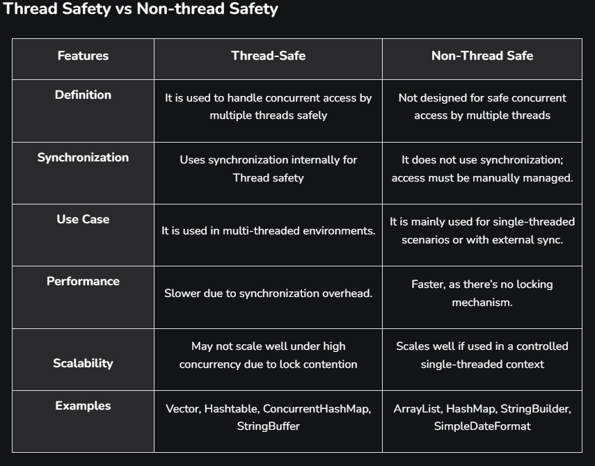

# Java Thread Safety and How to Achieve it?

Last Updated : 30 Oct, 2025
Thread Safety means when multiple threads access the same object or piece of code at the same time, the program still behaves correctly, without data corruption or unexpected results.

A class or method is thread-safe if it works fine even when accessed by many threads at once.
Even if threads run in any order, the shared data will always remain correct.
How to Achieve Thread Safety in Java?
There are four ways to achieve Thread Safety in Java. These are:

# 1. Using Synchronization

We use the synchronized keyword to ensure only one thread can access a method or block of code at a time. It helps in preventing race conditions.

# class A

{
synchronized void sum(int n){
#    // Creating a thread instance
    Thread t = Thread.currentThread();
    for (int i = 1; i <= 5; i++) {
    System.out.println(t.getName() + " : " + (n + i));
}
}
}

// Class B extending thread class
class B extends Thread
{
// Creating an object of class A
A a = new A();
public void run()
{

        // Calling sum() method
        a.sum(10);
    }

}

class Geeks
{
public static void main(String[] args)
{
// Creating an object of class B
B b = new B();

        // Initializing instance t1 of Thread class with object of class B
        Thread t1 = new Thread(b);

        // Initializing instance t2 of Thread class with object of class B
        Thread t2 = new Thread(b);

        // Initializing thread t1 with name 'Thread A'
        t1.setName("Thread A");

        // Initializing thread t2 with name 'Thread B'
        t2.setName("Thread B");

        // Starting thread instance t1 and t2
        t1.start();
        t2.start();
    }

# }

# OUTPUT
#   Thread A : 11
#   Thread A : 12
#   Thread A : 13
#   Thread A : 14
#   Thread A : 15
#   Thread B : 11
#   Thread B : 12
#   Thread B : 13
#   Thread B : 14
#   Thread B : 15

# Explanation
synchronized void sum(int n) ensures that only one thread executes the sum() method at a time.
When Thread A enters the method, it locks the monitor of object a.
Thread B waits until Thread A finishes.
After completion, the lock is released and Thread B can execute.

# 2. Using Volatile Keyword
Volatile Keyword ensures visibility of variable changes across threads. It does not guarantee atomicity, but ensures every thread reads the latest value from main memory, not cache.

public class Geeks {

    // Initializing volatile variables a, b
    static volatile int a = 0, b = 0;

    // Defining a static void method
    static void method_one() {
        a++;
        b++;
    }

    // Defining static void method
    static void method_two() {
        System.out.println("a=" + a +
                           " b=" + b);
    }

    public static void main(String[] args)
    {
        // Creating an instance t1 of Thread class
        Thread t1 = new Thread() 
        {
            public void run()
            {
                for (int i = 0; i < 5; i++)
                    method_one();
            }
        };

        // Creating an instance t2 of Thread class
        Thread t2 = new Thread() 
        {
            public void run()
            {
                for (int i = 0; i < 5; i++)
                    method_two();
            }
        };

        // Starting instance t1 and t2
        t1.start();
        t2.start();
    }
}

# OUTPUT
# a=5 b=5
# a=5 b=5
# a=5 b=5
# a=5 b=5
# a=5 b=5

# Explanation
The volatile keyword ensures that threads always read the latest value of variables a and b from main memory, not from thread-local cache.
So, when t1 updates the values, t2 instantly sees those updates.

# 3. Using Atomic Variable
Using an atomic variable is another way to achieve thread-safety in java. When variables are shared by multiple threads, the atomic variable ensures that threads don't crash into each other. 

import java.util.concurrent.atomic.AtomicInteger;

class Counter 
{
    // Creating a variable of class type AtomicInteger
    AtomicInteger count
        = new AtomicInteger();

    // Defining increment() method to change value of AtomicInteger variable
    public void increment() {
        count.incrementAndGet();
    }
}

public class TestCounter {
    public static void main(String[] args)
      		throws Exception
    {
        // Creating an instance of Counter class
        Counter c = new Counter();

        // Creating an instance t1 of Thread class
        Thread t1 = new Thread(new Runnable() 
        {
        	public void run() {
            	for(int i = 1; i <= 2000; i++) {
                	c.increment();
                }
            }
        });

        // Creating an instance t2 of Thread class
        Thread t2 = new Thread(new Runnable() 
        {
        	public void run() {
              	for (int i = 1; i <= 2000; i++) {
                  	c.increment();
                }
            }
        });

        // Calling start() method with t1 and t2
        t1.start();
        t2.start();

        // Calling join method with t1 and t2
        t1.join();
        t2.join();

        System.out.println(c.count);
    }
}

# OUTPUT: 4000
# Explanation
AtomicInteger internally uses compare-and-swap (CAS) operations for atomicity.
incrementAndGet() increments the value safely without requiring explicit synchronization.
Both threads increase the same counter correctly without conflict.

# 4. Using Immutable Objects
Immutable objects are inherently thread-safe, as their state cannot change after creation. Mark fields as final and don’t provide setters.

# final class Student {
    private final String name;
    private final int rollNo;

    public Student(String name, int rollNo) {
        this.name = name;
        this.rollNo = rollNo;
    }

    public String getName() {
        return name;
    }

    public int getRollNo() {
        return rollNo;
    }
# }

# Explanation
The class is declared final, preventing subclassing.
Fields are marked final, so their values can’t change after initialization.
No setters are provided, making the object’s state unchangeable.
Multiple threads can access the same Student object safely.

